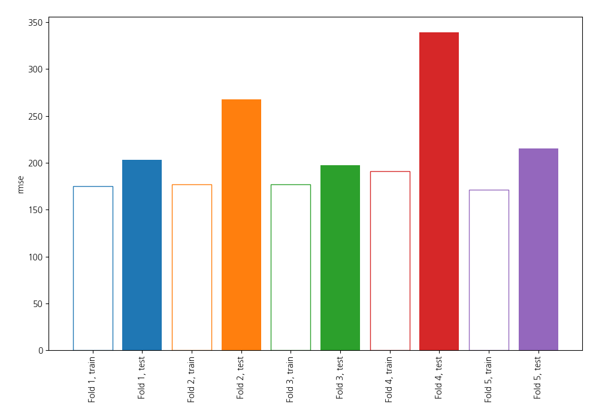
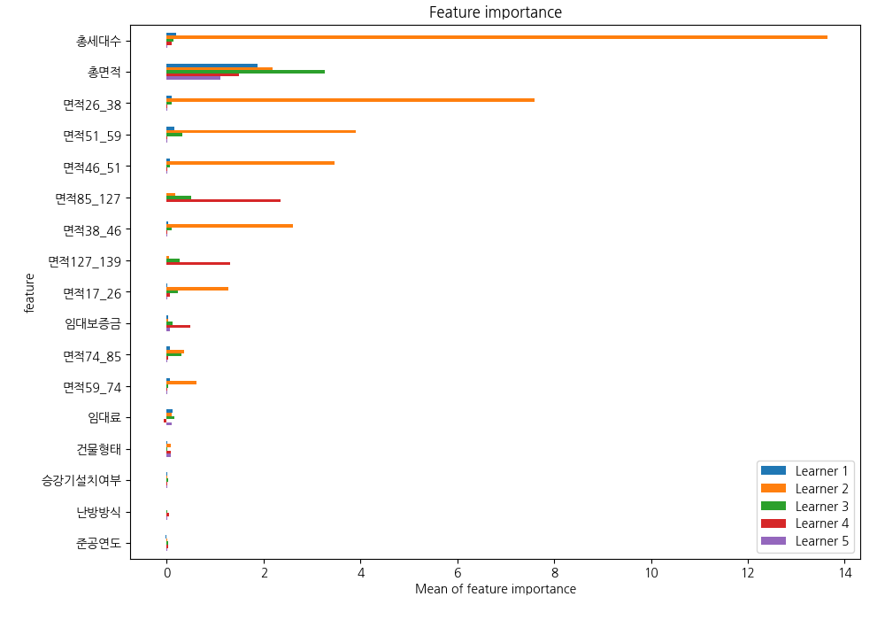
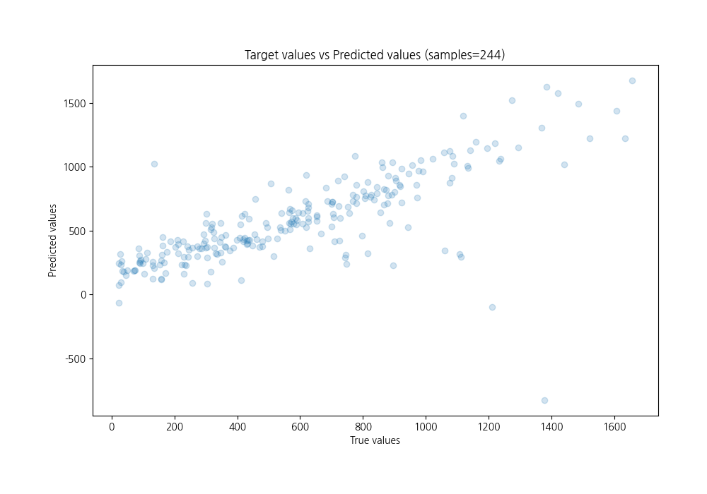
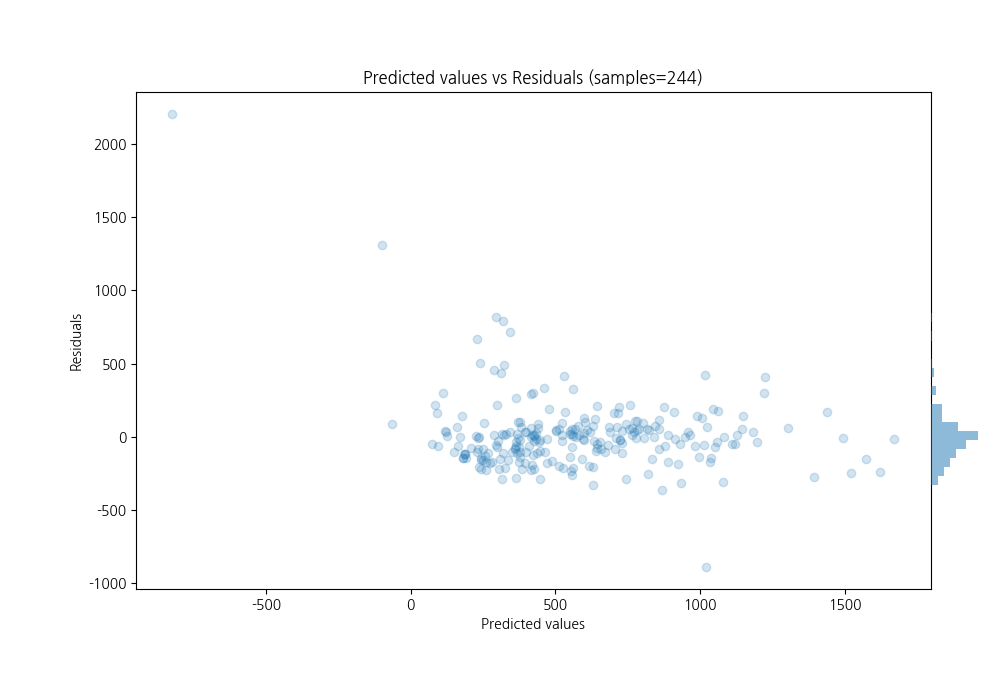

# Summary of 1_Linear

[<< Go back](../README.md)

## Linear Regression (Linear)
- **n_jobs**: -1
- **explain_level**: 1

## Validation
 - **validation_type**: kfold
 - **k_folds**: 5
 - **shuffle**: True

## Optimized metric
rmse

## Training time

9.5 seconds

### Metric details:
| Metric   |        Score |
|:---------|-------------:|
| MAE      |   143.379    |
| MSE      | 62768.3      |
| RMSE     |   250.536    |
| R2       |     0.545115 |
| MAPE     |     0.586793 |

## Learning curves

## Coefficients
| feature        |    Learner_1 |    Learner_2 |    Learner_3 |    Learner_4 |    Learner_5 |
|:---------------|-------------:|-------------:|-------------:|-------------:|-------------:|
| 총면적         |  0.992358    |  1.06451     |  1.24094     |  0.693847    |  0.785379    |
| 총세대수       |  0.283463    |  2.38718     |  0.204186    |  0.144063    |  0.099412    |
| 면적127_139    |  0.207051    |  0.130566    |  0.1652      |  0.703507    |  0.231117    |
| 임대보증금     |  0.211173    |  0.217615    |  0.228615    |  0.189868    |  0.248739    |
| 준공연도       |  0.126203    |  0.0822039   |  0.0944787   |  0.0785524   |  0.124684    |
| 승강기설치여부 |  0.0841751   |  0.0679042   |  0.0791659   |  0.100701    |  0.0783753   |
| 난방방식       |  0.0791019   |  0.0873839   |  0.0228166   |  0.0631038   |  0.0377048   |
| intercept      |  1.85109e-15 |  1.11986e-15 | -1.03546e-15 |  1.64039e-17 | -1.64162e-15 |
| 건물형태       | -0.150261    | -0.122787    | -0.180612    | -0.150935    | -0.112577    |
| 면적59_74      | -0.067147    | -0.886801    | -0.186825    |  0.0309088   |  0.0166587   |
| 임대료         | -0.254044    | -0.221477    | -0.279552    | -0.216643    | -0.263983    |
| 면적74_85      | -0.189994    | -1.09632     | -0.26749     |  0.0202409   |  0.0302677   |
| 면적17_26      | -0.250879    | -0.901744    | -0.183955    | -0.115303    | -0.127412    |
| 면적46_51      | -0.204268    | -1.05188     | -0.267738    | -0.0379707   | -0.0412186   |
| 면적38_46      | -0.217103    | -1.30326     | -0.256555    | -0.0203847   | -0.00856823  |
| 면적26_38      | -0.239808    | -1.33429     | -0.299627    | -0.0487274   | -0.0322642   |
| 면적85_127     | -0.330366    | -0.512443    | -0.327091    | -0.671315    | -0.292707    |
| 면적51_59      | -0.271493    | -1.54761     | -0.352303    | -0.0136234   | -0.0363626   |

## Permutation-based Importance

## True vs Predicted

## Predicted vs Residuals

[<< Go back](../README.md)
