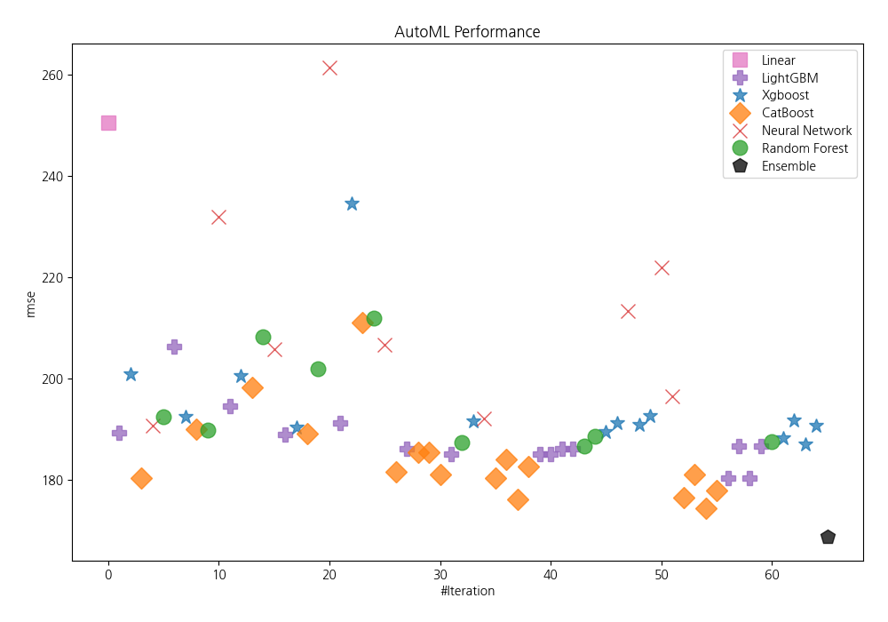
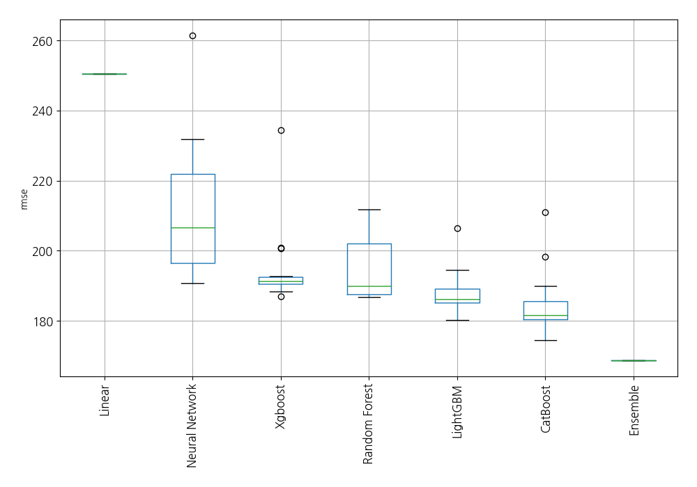
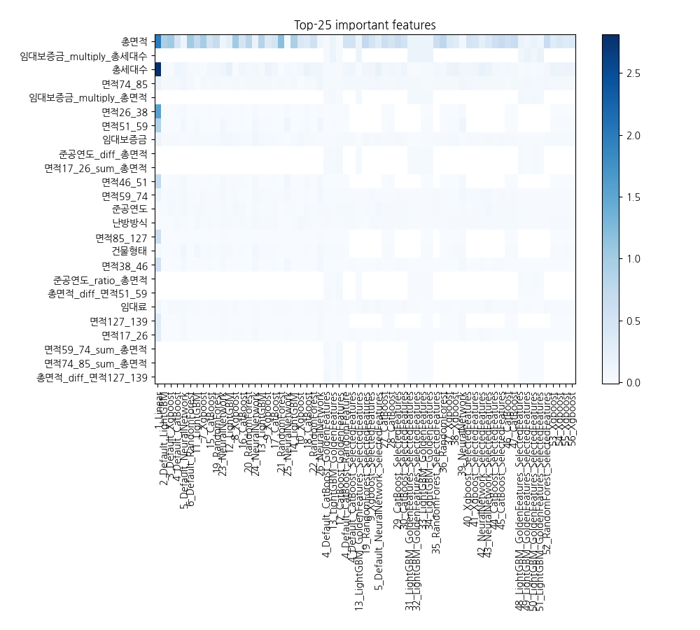

# AutoML Leaderboard

| Best model   | name                                                                                                 | model_type     | metric_type   |   metric_value |   train_time |   single_prediction_time |
|:-------------|:-----------------------------------------------------------------------------------------------------|:---------------|:--------------|---------------:|-------------:|-------------------------:|
|              | [1_Linear](1_Linear/README.md)                                                                       | Linear         | rmse          |        250.536 |        10.05 |                   0.055  |
|              | [2_Default_LightGBM](2_Default_LightGBM/README.md)                                                   | LightGBM       | rmse          |        189.385 |         2.02 |                   0.0591 |
|              | [3_Default_Xgboost](3_Default_Xgboost/README.md)                                                     | Xgboost        | rmse          |        200.804 |         3.72 |                   0.063  |
|              | [4_Default_CatBoost](4_Default_CatBoost/README.md)                                                   | CatBoost       | rmse          |        180.429 |        16.88 |                   0.023  |
|              | [5_Default_NeuralNetwork](5_Default_NeuralNetwork/README.md)                                         | Neural Network | rmse          |        190.663 |         1.56 |                   0.047  |
|              | [6_Default_RandomForest](6_Default_RandomForest/README.md)                                           | Random Forest  | rmse          |        192.454 |         3.62 |                   0.1173 |
|              | [11_LightGBM](11_LightGBM/README.md)                                                                 | LightGBM       | rmse          |        206.327 |         3    |                   0.057  |
|              | [7_Xgboost](7_Xgboost/README.md)                                                                     | Xgboost        | rmse          |        192.484 |         2.21 |                   0.057  |
|              | [15_CatBoost](15_CatBoost/README.md)                                                                 | CatBoost       | rmse          |        190.024 |        26.88 |                   0.024  |
|              | [19_RandomForest](19_RandomForest/README.md)                                                         | Random Forest  | rmse          |        189.9   |         3.8  |                   0.114  |
|              | [23_NeuralNetwork](23_NeuralNetwork/README.md)                                                       | Neural Network | rmse          |        231.839 |         1.59 |                   0.048  |
|              | [12_LightGBM](12_LightGBM/README.md)                                                                 | LightGBM       | rmse          |        194.537 |         1.98 |                   0.058  |
|              | [8_Xgboost](8_Xgboost/README.md)                                                                     | Xgboost        | rmse          |        200.597 |         2.35 |                   0.057  |
|              | [16_CatBoost](16_CatBoost/README.md)                                                                 | CatBoost       | rmse          |        198.225 |        23.39 |                   0.023  |
|              | [20_RandomForest](20_RandomForest/README.md)                                                         | Random Forest  | rmse          |        208.215 |         3.82 |                   0.1141 |
|              | [24_NeuralNetwork](24_NeuralNetwork/README.md)                                                       | Neural Network | rmse          |        205.773 |         1.72 |                   0.049  |
|              | [13_LightGBM](13_LightGBM/README.md)                                                                 | LightGBM       | rmse          |        188.982 |         2.68 |                   0.053  |
|              | [9_Xgboost](9_Xgboost/README.md)                                                                     | Xgboost        | rmse          |        190.361 |         2.2  |                   0.058  |
|              | [17_CatBoost](17_CatBoost/README.md)                                                                 | CatBoost       | rmse          |        189.175 |        17.74 |                   0.023  |
|              | [21_RandomForest](21_RandomForest/README.md)                                                         | Random Forest  | rmse          |        201.986 |         4.55 |                   0.115  |
|              | [25_NeuralNetwork](25_NeuralNetwork/README.md)                                                       | Neural Network | rmse          |        261.398 |         1.84 |                   0.048  |
|              | [14_LightGBM](14_LightGBM/README.md)                                                                 | LightGBM       | rmse          |        191.312 |         2.35 |                   0.044  |
|              | [10_Xgboost](10_Xgboost/README.md)                                                                   | Xgboost        | rmse          |        234.459 |         2.22 |                   0.056  |
|              | [18_CatBoost](18_CatBoost/README.md)                                                                 | CatBoost       | rmse          |        211.056 |        16.89 |                   0.0225 |
|              | [22_RandomForest](22_RandomForest/README.md)                                                         | Random Forest  | rmse          |        211.845 |         4.04 |                   0.1127 |
|              | [26_NeuralNetwork](26_NeuralNetwork/README.md)                                                       | Neural Network | rmse          |        206.71  |         1.86 |                   0.05   |
|              | [4_Default_CatBoost_GoldenFeatures](4_Default_CatBoost_GoldenFeatures/README.md)                     | CatBoost       | rmse          |        181.669 |        18.53 |                   0.041  |
|              | [13_LightGBM_GoldenFeatures](13_LightGBM_GoldenFeatures/README.md)                                   | LightGBM       | rmse          |        186.138 |         3.7  |                   0.0995 |
|              | [17_CatBoost_GoldenFeatures](17_CatBoost_GoldenFeatures/README.md)                                   | CatBoost       | rmse          |        185.364 |        16.55 |                   0.04   |
|              | [4_Default_CatBoost_RandomFeature](4_Default_CatBoost_RandomFeature/README.md)                       | CatBoost       | rmse          |        185.519 |        14.83 |                   0.027  |
|              | [4_Default_CatBoost_SelectedFeatures](4_Default_CatBoost_SelectedFeatures/README.md)                 | CatBoost       | rmse          |        181.085 |        13.3  |                   0.021  |
|              | [13_LightGBM_GoldenFeatures_SelectedFeatures](13_LightGBM_GoldenFeatures_SelectedFeatures/README.md) | LightGBM       | rmse          |        185.144 |         2.62 |                   0.094  |
|              | [19_RandomForest_SelectedFeatures](19_RandomForest_SelectedFeatures/README.md)                       | Random Forest  | rmse          |        187.461 |         3.39 |                   0.1112 |
|              | [9_Xgboost_SelectedFeatures](9_Xgboost_SelectedFeatures/README.md)                                   | Xgboost        | rmse          |        191.535 |         2.33 |                   0.054  |
|              | [5_Default_NeuralNetwork_SelectedFeatures](5_Default_NeuralNetwork_SelectedFeatures/README.md)       | Neural Network | rmse          |        192.08  |         1.97 |                   0.046  |
|              | [27_CatBoost](27_CatBoost/README.md)                                                                 | CatBoost       | rmse          |        180.356 |        13.18 |                   0.024  |
|              | [28_CatBoost](28_CatBoost/README.md)                                                                 | CatBoost       | rmse          |        184.055 |        19.1  |                   0.023  |
|              | [29_CatBoost_SelectedFeatures](29_CatBoost_SelectedFeatures/README.md)                               | CatBoost       | rmse          |        176.159 |        14.76 |                   0.022  |
|              | [30_CatBoost_SelectedFeatures](30_CatBoost_SelectedFeatures/README.md)                               | CatBoost       | rmse          |        182.714 |        16.43 |                   0.022  |
|              | [31_LightGBM_GoldenFeatures_SelectedFeatures](31_LightGBM_GoldenFeatures_SelectedFeatures/README.md) | LightGBM       | rmse          |        185.144 |         2.69 |                   0.095  |
|              | [32_LightGBM_GoldenFeatures_SelectedFeatures](32_LightGBM_GoldenFeatures_SelectedFeatures/README.md) | LightGBM       | rmse          |        185.144 |         2.73 |                   0.0935 |
|              | [33_LightGBM_GoldenFeatures](33_LightGBM_GoldenFeatures/README.md)                                   | LightGBM       | rmse          |        186.138 |         3.82 |                   0.098  |
|              | [34_LightGBM_GoldenFeatures](34_LightGBM_GoldenFeatures/README.md)                                   | LightGBM       | rmse          |        186.138 |         3.9  |                   0.096  |
|              | [35_RandomForest_SelectedFeatures](35_RandomForest_SelectedFeatures/README.md)                       | Random Forest  | rmse          |        186.679 |         4.84 |                   0.1116 |
|              | [36_RandomForest](36_RandomForest/README.md)                                                         | Random Forest  | rmse          |        188.625 |         4.61 |                   0.116  |
|              | [37_Xgboost](37_Xgboost/README.md)                                                                   | Xgboost        | rmse          |        189.422 |         2.66 |                   0.055  |
|              | [38_Xgboost](38_Xgboost/README.md)                                                                   | Xgboost        | rmse          |        191.303 |         2.54 |                   0.065  |
|              | [39_NeuralNetwork](39_NeuralNetwork/README.md)                                                       | Neural Network | rmse          |        213.357 |         2.26 |                   0.049  |
|              | [40_Xgboost_SelectedFeatures](40_Xgboost_SelectedFeatures/README.md)                                 | Xgboost        | rmse          |        190.85  |         2.61 |                   0.053  |
|              | [41_Xgboost_SelectedFeatures](41_Xgboost_SelectedFeatures/README.md)                                 | Xgboost        | rmse          |        192.659 |         2.46 |                   0.057  |
|              | [42_NeuralNetwork_SelectedFeatures](42_NeuralNetwork_SelectedFeatures/README.md)                     | Neural Network | rmse          |        221.852 |         2.17 |                   0.044  |
|              | [43_NeuralNetwork_SelectedFeatures](43_NeuralNetwork_SelectedFeatures/README.md)                     | Neural Network | rmse          |        196.423 |         2.25 |                   0.045  |
|              | [44_CatBoost_SelectedFeatures](44_CatBoost_SelectedFeatures/README.md)                               | CatBoost       | rmse          |        176.504 |        17.76 |                   0.022  |
|              | [45_CatBoost_SelectedFeatures](45_CatBoost_SelectedFeatures/README.md)                               | CatBoost       | rmse          |        181.042 |         8.99 |                   0.021  |
|              | [46_CatBoost](46_CatBoost/README.md)                                                                 | CatBoost       | rmse          |        174.478 |        19.98 |                   0.023  |
|              | [47_CatBoost](47_CatBoost/README.md)                                                                 | CatBoost       | rmse          |        177.828 |         9.83 |                   0.024  |
|              | [48_LightGBM_GoldenFeatures_SelectedFeatures](48_LightGBM_GoldenFeatures_SelectedFeatures/README.md) | LightGBM       | rmse          |        180.303 |         2.97 |                   0.093  |
|              | [49_LightGBM_GoldenFeatures_SelectedFeatures](49_LightGBM_GoldenFeatures_SelectedFeatures/README.md) | LightGBM       | rmse          |        186.72  |         3.21 |                   0.093  |
|              | [50_LightGBM_GoldenFeatures_SelectedFeatures](50_LightGBM_GoldenFeatures_SelectedFeatures/README.md) | LightGBM       | rmse          |        180.303 |         2.91 |                   0.094  |
|              | [51_LightGBM_GoldenFeatures_SelectedFeatures](51_LightGBM_GoldenFeatures_SelectedFeatures/README.md) | LightGBM       | rmse          |        186.72  |         3.2  |                   0.093  |
|              | [52_RandomForest_SelectedFeatures](52_RandomForest_SelectedFeatures/README.md)                       | Random Forest  | rmse          |        187.493 |         3.96 |                   0.1137 |
|              | [53_Xgboost](53_Xgboost/README.md)                                                                   | Xgboost        | rmse          |        188.292 |         2.91 |                   0.054  |
|              | [54_Xgboost](54_Xgboost/README.md)                                                                   | Xgboost        | rmse          |        191.738 |         2.91 |                   0.062  |
|              | [55_Xgboost](55_Xgboost/README.md)                                                                   | Xgboost        | rmse          |        186.944 |         2.9  |                   0.068  |
|              | [56_Xgboost](56_Xgboost/README.md)                                                                   | Xgboost        | rmse          |        190.778 |         2.86 |                   0.058  |
| **the best** | [Ensemble](Ensemble/README.md)                                                                       | Ensemble       | rmse          |        168.711 |         0.53 |                   0.424  |

### AutoML Performance

### AutoML Performance Boxplot

### Features Importance

### Spearman Correlation of Models

