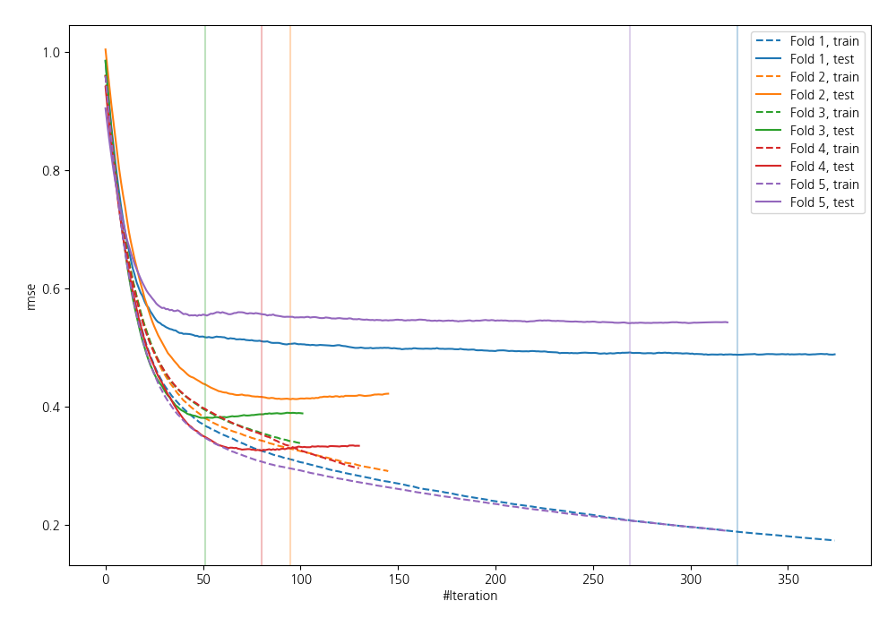
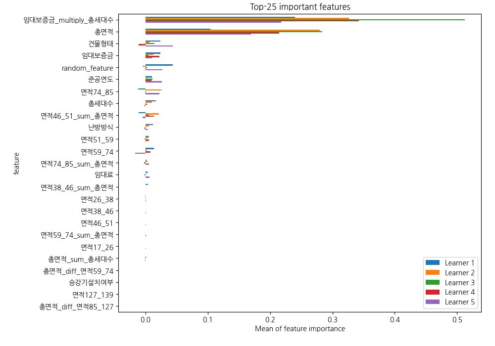
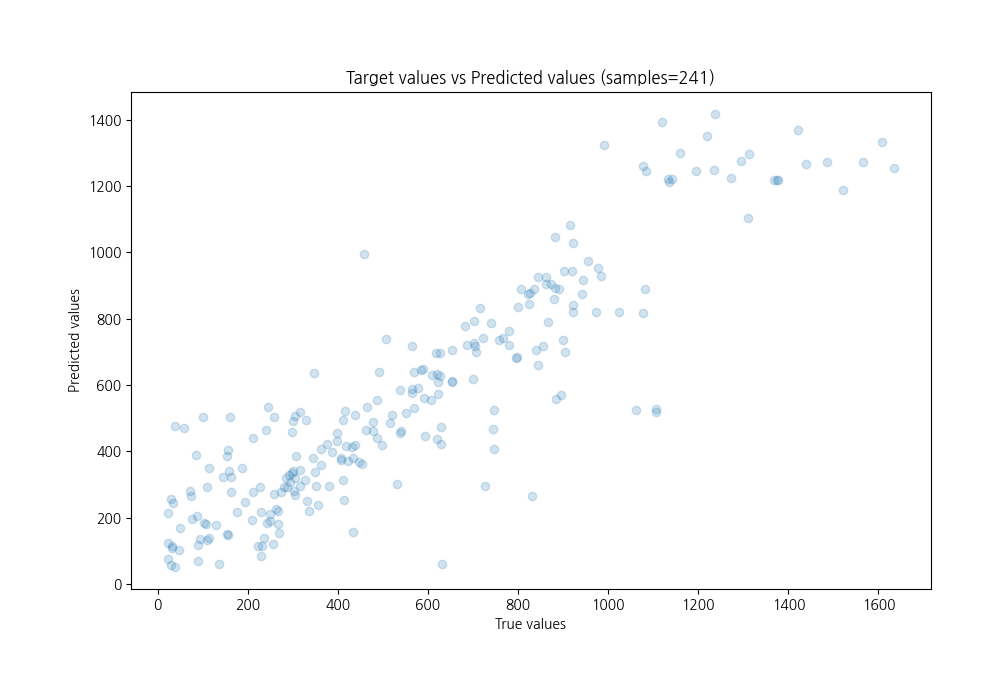

# Summary of 13_LightGBM_GoldenFeatures_RandomFeature

[<< Go back](../README.md)

## LightGBM
- **n_jobs**: -1
- **objective**: regression
- **num_leaves**: 63
- **learning_rate**: 0.05
- **feature_fraction**: 0.9
- **bagging_fraction**: 1.0
- **min_data_in_leaf**: 20
- **metric**: rmse
- **custom_eval_metric_name**: None
- **explain_level**: 1

## Validation
 - **validation_type**: kfold
 - **k_folds**: 5
 - **shuffle**: True

## Optimized metric
rmse

## Training time

4.9 seconds

### Metric details:
| Metric   |        Score |
|:---------|-------------:|
| MAE      |   115.658    |
| MSE      | 27282.6      |
| RMSE     |   165.174    |
| R2       |     0.808977 |
| MAPE     |     0.539833 |

## Learning curves

## Permutation-based Importance

## True vs Predicted

## Predicted vs Residuals

[<< Go back](../README.md)
