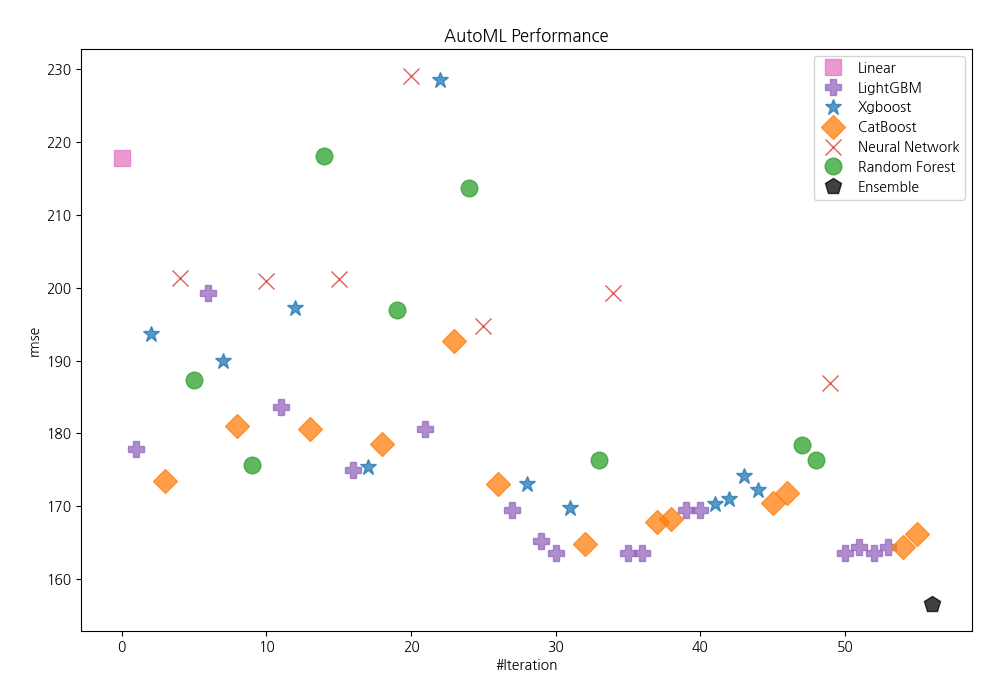
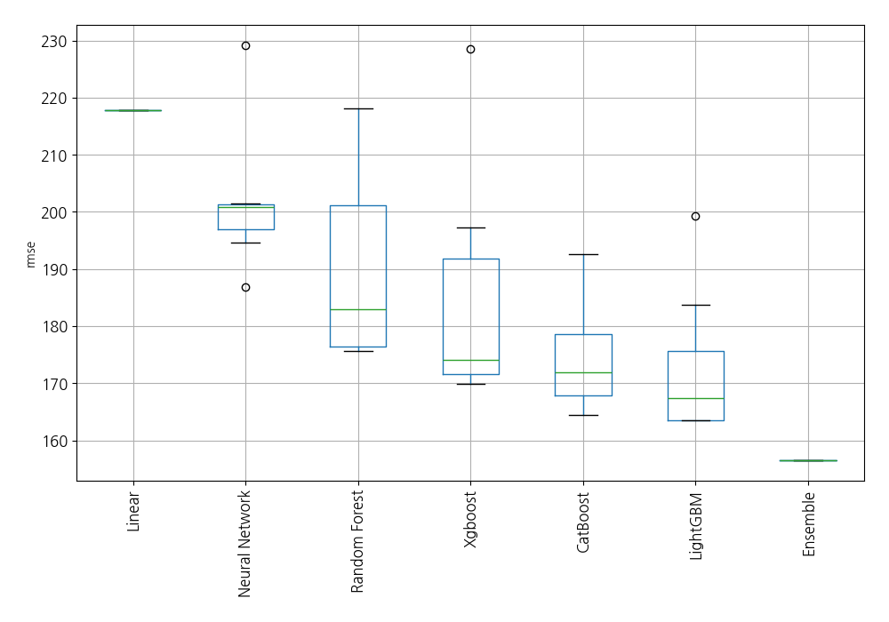
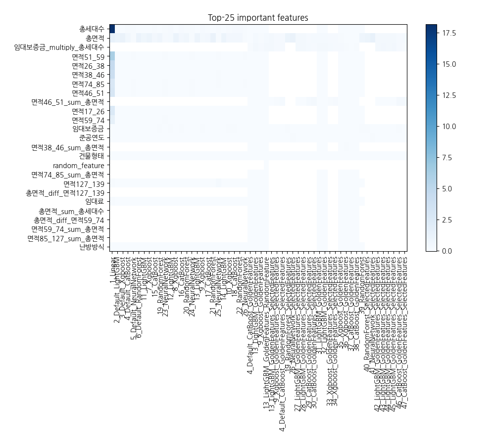
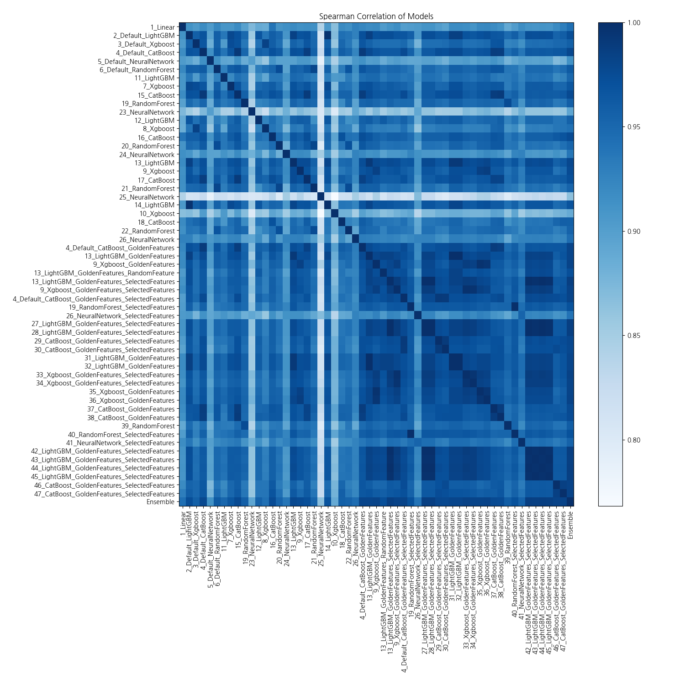

# AutoML Leaderboard

| Best model   | name                                                                                                               | model_type     | metric_type   |   metric_value |   train_time |   single_prediction_time |
|:-------------|:-------------------------------------------------------------------------------------------------------------------|:---------------|:--------------|---------------:|-------------:|-------------------------:|
|              | [1_Linear](1_Linear/README.md)                                                                                     | Linear         | rmse          |        217.828 |        17.72 |                   0.049  |
|              | [2_Default_LightGBM](2_Default_LightGBM/README.md)                                                                 | LightGBM       | rmse          |        177.834 |         9.71 |                   0.058  |
|              | [3_Default_Xgboost](3_Default_Xgboost/README.md)                                                                   | Xgboost        | rmse          |        193.661 |         5.8  |                   0.059  |
|              | [4_Default_CatBoost](4_Default_CatBoost/README.md)                                                                 | CatBoost       | rmse          |        173.54  |        14.45 |                   0.024  |
|              | [5_Default_NeuralNetwork](5_Default_NeuralNetwork/README.md)                                                       | Neural Network | rmse          |        201.409 |         3.91 |                   0.055  |
|              | [6_Default_RandomForest](6_Default_RandomForest/README.md)                                                         | Random Forest  | rmse          |        187.347 |        10.89 |                   0.1185 |
|              | [11_LightGBM](11_LightGBM/README.md)                                                                               | LightGBM       | rmse          |        199.24  |        10.76 |                   0.057  |
|              | [7_Xgboost](7_Xgboost/README.md)                                                                                   | Xgboost        | rmse          |        189.914 |         4.3  |                   0.054  |
|              | [15_CatBoost](15_CatBoost/README.md)                                                                               | CatBoost       | rmse          |        181.092 |        28.07 |                   0.023  |
|              | [19_RandomForest](19_RandomForest/README.md)                                                                       | Random Forest  | rmse          |        175.625 |        12.78 |                   0.1233 |
|              | [23_NeuralNetwork](23_NeuralNetwork/README.md)                                                                     | Neural Network | rmse          |        200.885 |         3.95 |                   0.049  |
|              | [12_LightGBM](12_LightGBM/README.md)                                                                               | LightGBM       | rmse          |        183.667 |         9.8  |                   0.057  |
|              | [8_Xgboost](8_Xgboost/README.md)                                                                                   | Xgboost        | rmse          |        197.213 |         4.52 |                   0.0805 |
|              | [16_CatBoost](16_CatBoost/README.md)                                                                               | CatBoost       | rmse          |        180.61  |        23.49 |                   0.025  |
|              | [20_RandomForest](20_RandomForest/README.md)                                                                       | Random Forest  | rmse          |        218.18  |        12.32 |                   0.117  |
|              | [24_NeuralNetwork](24_NeuralNetwork/README.md)                                                                     | Neural Network | rmse          |        201.169 |         4.09 |                   0.048  |
|              | [13_LightGBM](13_LightGBM/README.md)                                                                               | LightGBM       | rmse          |        174.932 |         9.93 |                   0.061  |
|              | [9_Xgboost](9_Xgboost/README.md)                                                                                   | Xgboost        | rmse          |        175.331 |         4.8  |                   0.075  |
|              | [17_CatBoost](17_CatBoost/README.md)                                                                               | CatBoost       | rmse          |        178.577 |        16.9  |                   0.023  |
|              | [21_RandomForest](21_RandomForest/README.md)                                                                       | Random Forest  | rmse          |        196.916 |        10.92 |                   0.12   |
|              | [25_NeuralNetwork](25_NeuralNetwork/README.md)                                                                     | Neural Network | rmse          |        229.162 |         4.29 |                   0.051  |
|              | [14_LightGBM](14_LightGBM/README.md)                                                                               | LightGBM       | rmse          |        180.549 |        10    |                   0.058  |
|              | [10_Xgboost](10_Xgboost/README.md)                                                                                 | Xgboost        | rmse          |        228.563 |         4.75 |                   0.053  |
|              | [18_CatBoost](18_CatBoost/README.md)                                                                               | CatBoost       | rmse          |        192.65  |        19.35 |                   0.023  |
|              | [22_RandomForest](22_RandomForest/README.md)                                                                       | Random Forest  | rmse          |        213.702 |        11.25 |                   0.1178 |
|              | [26_NeuralNetwork](26_NeuralNetwork/README.md)                                                                     | Neural Network | rmse          |        194.699 |         4.29 |                   0.049  |
|              | [4_Default_CatBoost_GoldenFeatures](4_Default_CatBoost_GoldenFeatures/README.md)                                   | CatBoost       | rmse          |        173.065 |        14.74 |                   0.041  |
|              | [13_LightGBM_GoldenFeatures](13_LightGBM_GoldenFeatures/README.md)                                                 | LightGBM       | rmse          |        169.497 |        10.9  |                   0.098  |
|              | [9_Xgboost_GoldenFeatures](9_Xgboost_GoldenFeatures/README.md)                                                     | Xgboost        | rmse          |        173.035 |         5.02 |                   0.112  |
|              | [13_LightGBM_GoldenFeatures_RandomFeature](13_LightGBM_GoldenFeatures_RandomFeature/README.md)                     | LightGBM       | rmse          |        165.174 |         5.36 |                   0.102  |
| **the best** | [13_LightGBM_GoldenFeatures_SelectedFeatures](13_LightGBM_GoldenFeatures_SelectedFeatures/README.md)               | LightGBM       | rmse          |        163.562 |         8.65 |                   0.0625 |
|              | [9_Xgboost_GoldenFeatures_SelectedFeatures](9_Xgboost_GoldenFeatures_SelectedFeatures/README.md)                   | Xgboost        | rmse          |        169.809 |         8.55 |                   0.067  |
|              | [4_Default_CatBoost_GoldenFeatures_SelectedFeatures](4_Default_CatBoost_GoldenFeatures_SelectedFeatures/README.md) | CatBoost       | rmse          |        164.759 |        15.33 |                   0.028  |
|              | [19_RandomForest_SelectedFeatures](19_RandomForest_SelectedFeatures/README.md)                                     | Random Forest  | rmse          |        176.408 |         8.55 |                   0.1041 |
|              | [26_NeuralNetwork_SelectedFeatures](26_NeuralNetwork_SelectedFeatures/README.md)                                   | Neural Network | rmse          |        199.348 |         4.2  |                   0.037  |
|              | [27_LightGBM_GoldenFeatures_SelectedFeatures](27_LightGBM_GoldenFeatures_SelectedFeatures/README.md)               | LightGBM       | rmse          |        163.562 |         8.72 |                   0.062  |
|              | [28_LightGBM_GoldenFeatures_SelectedFeatures](28_LightGBM_GoldenFeatures_SelectedFeatures/README.md)               | LightGBM       | rmse          |        163.562 |         8.71 |                   0.063  |
|              | [29_CatBoost_GoldenFeatures_SelectedFeatures](29_CatBoost_GoldenFeatures_SelectedFeatures/README.md)               | CatBoost       | rmse          |        167.854 |        12.6  |                   0.028  |
|              | [30_CatBoost_GoldenFeatures_SelectedFeatures](30_CatBoost_GoldenFeatures_SelectedFeatures/README.md)               | CatBoost       | rmse          |        168.213 |        15.84 |                   0.028  |
|              | [31_LightGBM_GoldenFeatures](31_LightGBM_GoldenFeatures/README.md)                                                 | LightGBM       | rmse          |        169.497 |        10.86 |                   0.0955 |
|              | [32_LightGBM_GoldenFeatures](32_LightGBM_GoldenFeatures/README.md)                                                 | LightGBM       | rmse          |        169.497 |        10.99 |                   0.097  |
|              | [33_Xgboost_GoldenFeatures_SelectedFeatures](33_Xgboost_GoldenFeatures_SelectedFeatures/README.md)                 | Xgboost        | rmse          |        170.377 |         8.67 |                   0.057  |
|              | [34_Xgboost_GoldenFeatures_SelectedFeatures](34_Xgboost_GoldenFeatures_SelectedFeatures/README.md)                 | Xgboost        | rmse          |        170.966 |         8.63 |                   0.074  |
|              | [35_Xgboost_GoldenFeatures](35_Xgboost_GoldenFeatures/README.md)                                                   | Xgboost        | rmse          |        174.131 |         5.28 |                   0.096  |
|              | [36_Xgboost_GoldenFeatures](36_Xgboost_GoldenFeatures/README.md)                                                   | Xgboost        | rmse          |        172.18  |         5.06 |                   0.074  |
|              | [37_CatBoost_GoldenFeatures](37_CatBoost_GoldenFeatures/README.md)                                                 | CatBoost       | rmse          |        170.506 |        15.11 |                   0.04   |
|              | [38_CatBoost_GoldenFeatures](38_CatBoost_GoldenFeatures/README.md)                                                 | CatBoost       | rmse          |        171.875 |        18.77 |                   0.047  |
|              | [39_RandomForest](39_RandomForest/README.md)                                                                       | Random Forest  | rmse          |        178.467 |        11.22 |                   0.1146 |
|              | [40_RandomForest_SelectedFeatures](40_RandomForest_SelectedFeatures/README.md)                                     | Random Forest  | rmse          |        176.408 |         8.67 |                   0.1086 |
|              | [41_NeuralNetwork_SelectedFeatures](41_NeuralNetwork_SelectedFeatures/README.md)                                   | Neural Network | rmse          |        186.892 |         4.47 |                   0.0363 |
|              | [42_LightGBM_GoldenFeatures_SelectedFeatures](42_LightGBM_GoldenFeatures_SelectedFeatures/README.md)               | LightGBM       | rmse          |        163.562 |         9.01 |                   0.0625 |
|              | [43_LightGBM_GoldenFeatures_SelectedFeatures](43_LightGBM_GoldenFeatures_SelectedFeatures/README.md)               | LightGBM       | rmse          |        164.379 |         9.04 |                   0.063  |
|              | [44_LightGBM_GoldenFeatures_SelectedFeatures](44_LightGBM_GoldenFeatures_SelectedFeatures/README.md)               | LightGBM       | rmse          |        163.562 |         9.13 |                   0.041  |
|              | [45_LightGBM_GoldenFeatures_SelectedFeatures](45_LightGBM_GoldenFeatures_SelectedFeatures/README.md)               | LightGBM       | rmse          |        164.379 |         9.08 |                   0.0625 |
|              | [46_CatBoost_GoldenFeatures_SelectedFeatures](46_CatBoost_GoldenFeatures_SelectedFeatures/README.md)               | CatBoost       | rmse          |        164.385 |        17.55 |                   0.028  |
|              | [47_CatBoost_GoldenFeatures_SelectedFeatures](47_CatBoost_GoldenFeatures_SelectedFeatures/README.md)               | CatBoost       | rmse          |        166.22  |        16.26 |                   0.031  |
|              | [Ensemble](Ensemble/README.md)                                                                                     | Ensemble       | rmse          |        156.513 |         0.61 |                   0.552  |

### AutoML Performance

### AutoML Performance Boxplot

### Features Importance

### Spearman Correlation of Models

