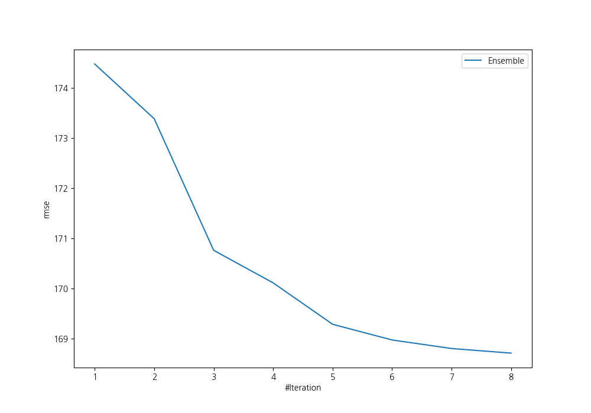
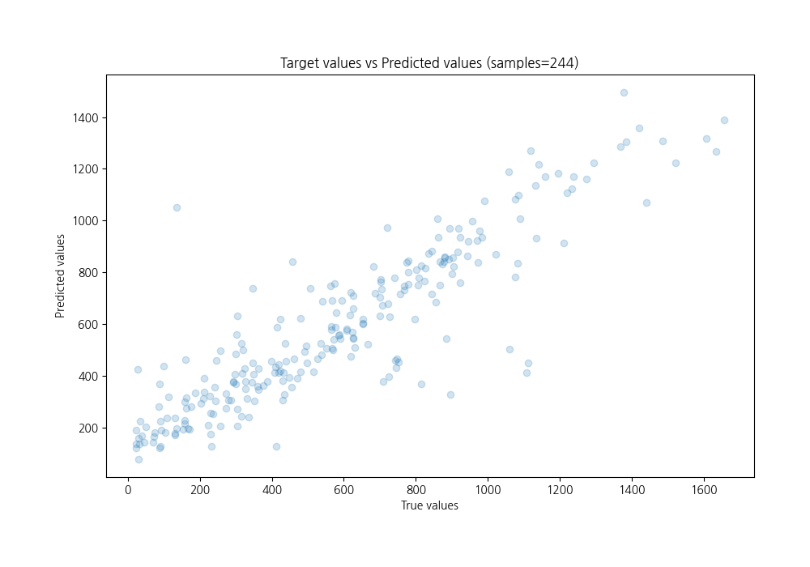
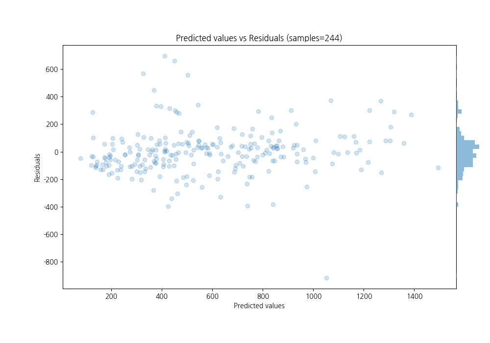

# Summary of Ensemble

[<< Go back](../README.md)

## Ensemble structure
| Model                                       |   Weight |
|:--------------------------------------------|---------:|
| 19_RandomForest_SelectedFeatures            |        1 |
| 24_NeuralNetwork                            |        1 |
| 29_CatBoost_SelectedFeatures                |        1 |
| 43_NeuralNetwork_SelectedFeatures           |        1 |
| 46_CatBoost                                 |        1 |
| 48_LightGBM_GoldenFeatures_SelectedFeatures |        1 |
| 49_LightGBM_GoldenFeatures_SelectedFeatures |        1 |
| 5_Default_NeuralNetwork                     |        1 |

### Metric details:
| Metric   |        Score |
|:---------|-------------:|
| MAE      |   113.894    |
| MSE      | 28463.6      |
| RMSE     |   168.711    |
| R2       |     0.793723 |
| MAPE     |     0.525428 |

## Learning curves

## True vs Predicted

## Predicted vs Residuals

[<< Go back](../README.md)
