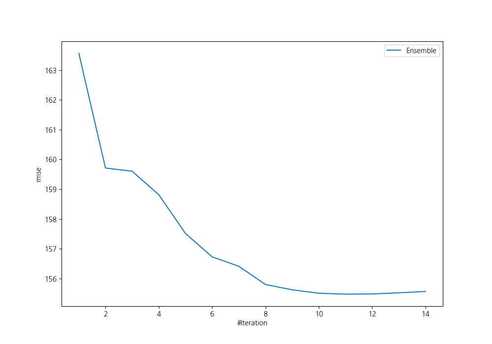
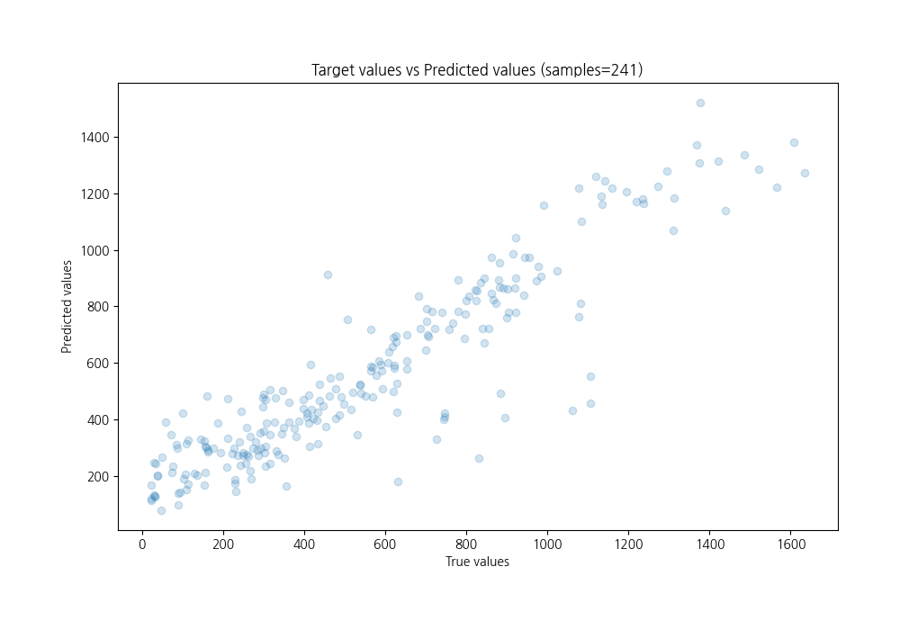
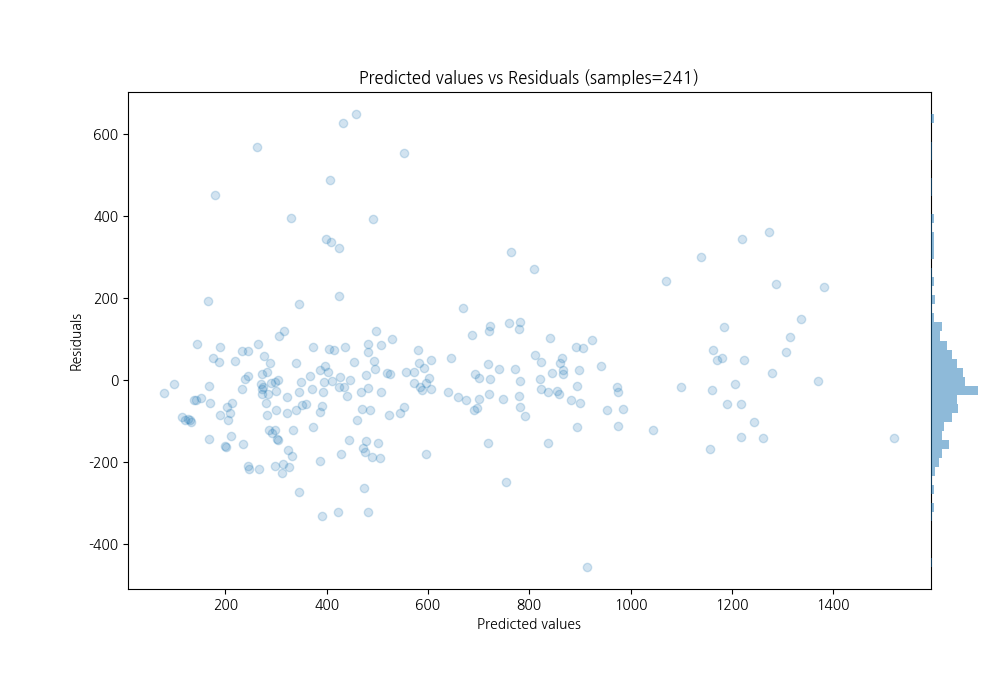

# Summary of Ensemble

[<< Go back](../README.md)

## Ensemble structure
| Model                                       |   Weight |
|:--------------------------------------------|---------:|
| 13_LightGBM_GoldenFeatures_SelectedFeatures |        3 |
| 25_NeuralNetwork                            |        1 |
| 46_CatBoost_GoldenFeatures_SelectedFeatures |        3 |
| 48_Xgboost_GoldenFeatures_SelectedFeatures  |        1 |
| 57_NeuralNetwork_SelectedFeatures           |        1 |
| 58_NeuralNetwork                            |        1 |
| 9_Xgboost                                   |        1 |

### Metric details:
| Metric   |        Score |
|:---------|-------------:|
| MAE      |   105.76     |
| MSE      | 24172.8      |
| RMSE     |   155.476    |
| R2       |     0.83075  |
| MAPE     |     0.520654 |

## Learning curves

## True vs Predicted

## Predicted vs Residuals

[<< Go back](../README.md)
