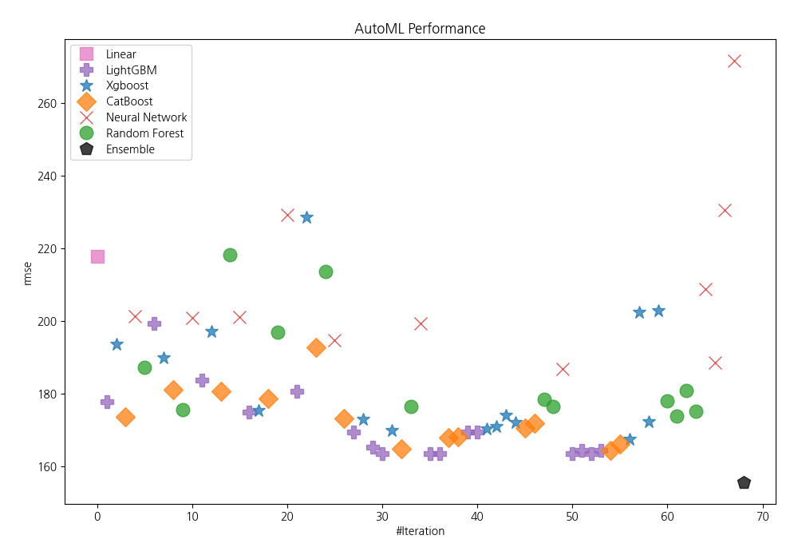
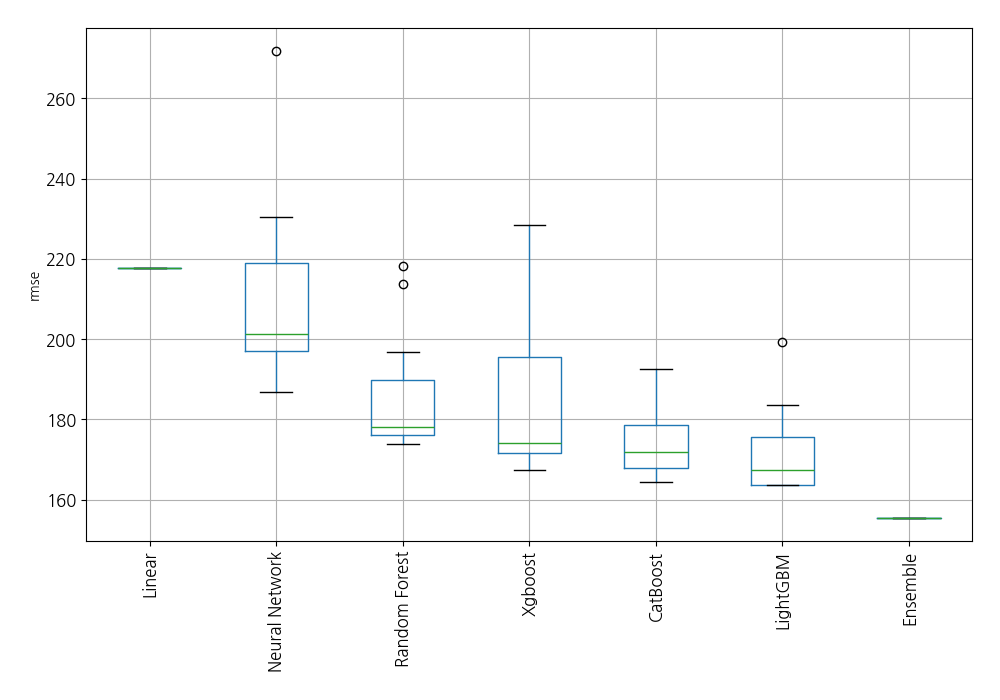
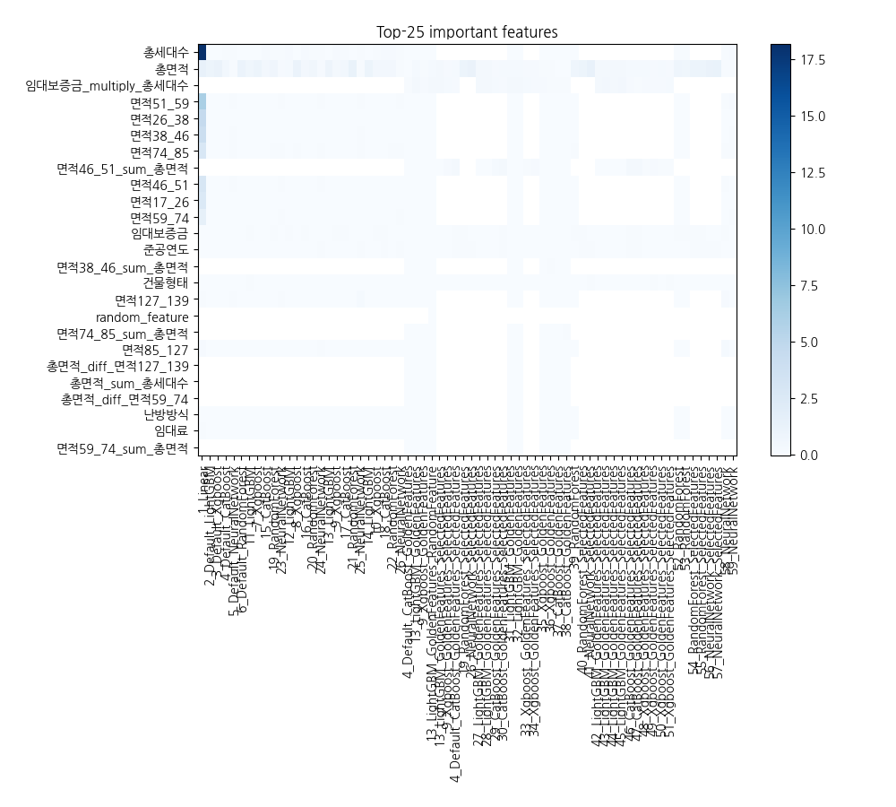
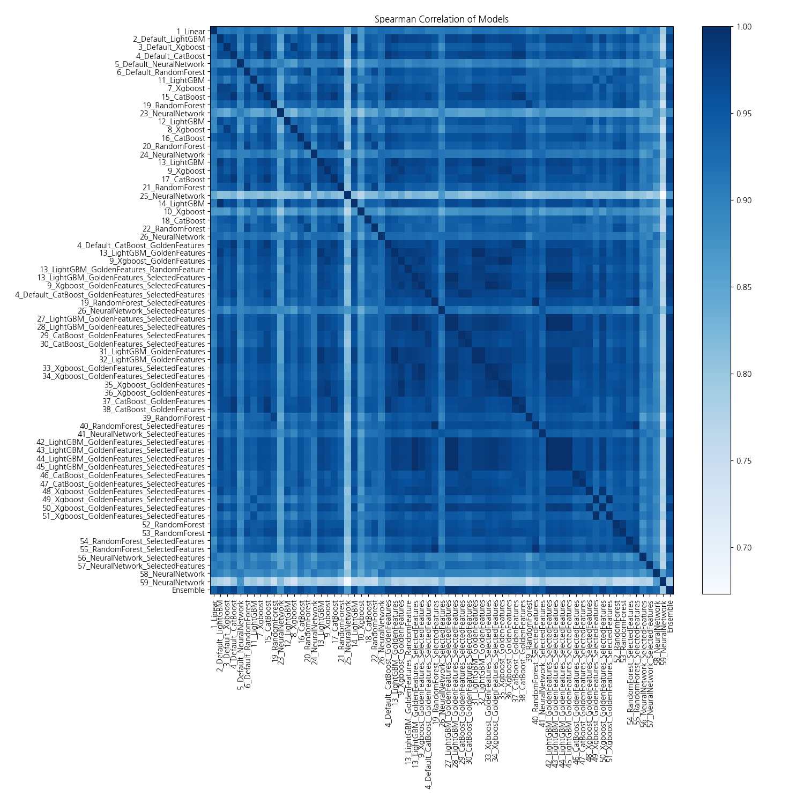

# AutoML Leaderboard

| Best model   | name                                                                                                               | model_type     | metric_type   |   metric_value |   train_time |   single_prediction_time |
|:-------------|:-------------------------------------------------------------------------------------------------------------------|:---------------|:--------------|---------------:|-------------:|-------------------------:|
|              | [1_Linear](1_Linear/README.md)                                                                                     | Linear         | rmse          |        217.828 |        11.19 |                   0.05   |
|              | [2_Default_LightGBM](2_Default_LightGBM/README.md)                                                                 | LightGBM       | rmse          |        177.834 |         2.96 |                   0.057  |
|              | [3_Default_Xgboost](3_Default_Xgboost/README.md)                                                                   | Xgboost        | rmse          |        193.661 |         4.5  |                   0.068  |
|              | [4_Default_CatBoost](4_Default_CatBoost/README.md)                                                                 | CatBoost       | rmse          |        173.54  |        12.25 |                   0.023  |
|              | [5_Default_NeuralNetwork](5_Default_NeuralNetwork/README.md)                                                       | Neural Network | rmse          |        201.409 |         2.61 |                   0.05   |
|              | [6_Default_RandomForest](6_Default_RandomForest/README.md)                                                         | Random Forest  | rmse          |        187.347 |         4.3  |                   0.114  |
|              | [11_LightGBM](11_LightGBM/README.md)                                                                               | LightGBM       | rmse          |        199.24  |         3.9  |                   0.0565 |
|              | [7_Xgboost](7_Xgboost/README.md)                                                                                   | Xgboost        | rmse          |        189.914 |         3.05 |                   0.052  |
|              | [15_CatBoost](15_CatBoost/README.md)                                                                               | CatBoost       | rmse          |        181.092 |        24.74 |                   0.024  |
|              | [19_RandomForest](19_RandomForest/README.md)                                                                       | Random Forest  | rmse          |        175.625 |         6.38 |                   0.1272 |
|              | [23_NeuralNetwork](23_NeuralNetwork/README.md)                                                                     | Neural Network | rmse          |        200.885 |         2.68 |                   0.048  |
|              | [12_LightGBM](12_LightGBM/README.md)                                                                               | LightGBM       | rmse          |        183.667 |         3.03 |                   0.057  |
|              | [8_Xgboost](8_Xgboost/README.md)                                                                                   | Xgboost        | rmse          |        197.213 |         3.23 |                   0.057  |
|              | [16_CatBoost](16_CatBoost/README.md)                                                                               | CatBoost       | rmse          |        180.61  |        20.66 |                   0.023  |
|              | [20_RandomForest](20_RandomForest/README.md)                                                                       | Random Forest  | rmse          |        218.18  |         5.77 |                   0.114  |
|              | [24_NeuralNetwork](24_NeuralNetwork/README.md)                                                                     | Neural Network | rmse          |        201.169 |         2.79 |                   0.0495 |
|              | [13_LightGBM](13_LightGBM/README.md)                                                                               | LightGBM       | rmse          |        174.932 |         3.19 |                   0.057  |
|              | [9_Xgboost](9_Xgboost/README.md)                                                                                   | Xgboost        | rmse          |        175.331 |         3.36 |                   0.053  |
|              | [17_CatBoost](17_CatBoost/README.md)                                                                               | CatBoost       | rmse          |        178.577 |        14.6  |                   0.022  |
|              | [21_RandomForest](21_RandomForest/README.md)                                                                       | Random Forest  | rmse          |        196.916 |         4.52 |                   0.117  |
|              | [25_NeuralNetwork](25_NeuralNetwork/README.md)                                                                     | Neural Network | rmse          |        229.162 |         2.92 |                   0.051  |
|              | [14_LightGBM](14_LightGBM/README.md)                                                                               | LightGBM       | rmse          |        180.549 |         3.23 |                   0.056  |
|              | [10_Xgboost](10_Xgboost/README.md)                                                                                 | Xgboost        | rmse          |        228.563 |         3.43 |                   0.058  |
|              | [18_CatBoost](18_CatBoost/README.md)                                                                               | CatBoost       | rmse          |        192.65  |        16.6  |                   0.022  |
|              | [22_RandomForest](22_RandomForest/README.md)                                                                       | Random Forest  | rmse          |        213.702 |         4.71 |                   0.1136 |
|              | [26_NeuralNetwork](26_NeuralNetwork/README.md)                                                                     | Neural Network | rmse          |        194.699 |         2.99 |                   0.049  |
|              | [4_Default_CatBoost_GoldenFeatures](4_Default_CatBoost_GoldenFeatures/README.md)                                   | CatBoost       | rmse          |        173.065 |        12.27 |                   0.0402 |
|              | [13_LightGBM_GoldenFeatures](13_LightGBM_GoldenFeatures/README.md)                                                 | LightGBM       | rmse          |        169.497 |         3.6  |                   0.0955 |
|              | [9_Xgboost_GoldenFeatures](9_Xgboost_GoldenFeatures/README.md)                                                     | Xgboost        | rmse          |        173.035 |         3.6  |                   0.073  |
|              | [13_LightGBM_GoldenFeatures_RandomFeature](13_LightGBM_GoldenFeatures_RandomFeature/README.md)                     | LightGBM       | rmse          |        165.174 |         4.07 |                   0.095  |
|              | [13_LightGBM_GoldenFeatures_SelectedFeatures](13_LightGBM_GoldenFeatures_SelectedFeatures/README.md)               | LightGBM       | rmse          |        163.562 |         3.17 |                   0.0615 |
|              | [9_Xgboost_GoldenFeatures_SelectedFeatures](9_Xgboost_GoldenFeatures_SelectedFeatures/README.md)                   | Xgboost        | rmse          |        169.809 |         3.23 |                   0.054  |
|              | [4_Default_CatBoost_GoldenFeatures_SelectedFeatures](4_Default_CatBoost_GoldenFeatures_SelectedFeatures/README.md) | CatBoost       | rmse          |        164.759 |        12.88 |                   0.0275 |
|              | [19_RandomForest_SelectedFeatures](19_RandomForest_SelectedFeatures/README.md)                                     | Random Forest  | rmse          |        176.408 |         4.22 |                   0.1058 |
|              | [26_NeuralNetwork_SelectedFeatures](26_NeuralNetwork_SelectedFeatures/README.md)                                   | Neural Network | rmse          |        199.348 |         2.84 |                   0.039  |
|              | [27_LightGBM_GoldenFeatures_SelectedFeatures](27_LightGBM_GoldenFeatures_SelectedFeatures/README.md)               | LightGBM       | rmse          |        163.562 |         3.26 |                   0.062  |
|              | [28_LightGBM_GoldenFeatures_SelectedFeatures](28_LightGBM_GoldenFeatures_SelectedFeatures/README.md)               | LightGBM       | rmse          |        163.562 |         3.18 |                   0.062  |
|              | [29_CatBoost_GoldenFeatures_SelectedFeatures](29_CatBoost_GoldenFeatures_SelectedFeatures/README.md)               | CatBoost       | rmse          |        167.854 |        10.58 |                   0.026  |
|              | [30_CatBoost_GoldenFeatures_SelectedFeatures](30_CatBoost_GoldenFeatures_SelectedFeatures/README.md)               | CatBoost       | rmse          |        168.213 |        13.35 |                   0.028  |
|              | [31_LightGBM_GoldenFeatures](31_LightGBM_GoldenFeatures/README.md)                                                 | LightGBM       | rmse          |        169.497 |         3.68 |                   0.076  |
|              | [32_LightGBM_GoldenFeatures](32_LightGBM_GoldenFeatures/README.md)                                                 | LightGBM       | rmse          |        169.497 |         3.72 |                   0.0966 |
|              | [33_Xgboost_GoldenFeatures_SelectedFeatures](33_Xgboost_GoldenFeatures_SelectedFeatures/README.md)                 | Xgboost        | rmse          |        170.377 |         3.38 |                   0.068  |
|              | [34_Xgboost_GoldenFeatures_SelectedFeatures](34_Xgboost_GoldenFeatures_SelectedFeatures/README.md)                 | Xgboost        | rmse          |        170.966 |         3.29 |                   0.062  |
|              | [35_Xgboost_GoldenFeatures](35_Xgboost_GoldenFeatures/README.md)                                                   | Xgboost        | rmse          |        174.131 |         3.92 |                   0.09   |
|              | [36_Xgboost_GoldenFeatures](36_Xgboost_GoldenFeatures/README.md)                                                   | Xgboost        | rmse          |        172.18  |         3.75 |                   0.0835 |
|              | [37_CatBoost_GoldenFeatures](37_CatBoost_GoldenFeatures/README.md)                                                 | CatBoost       | rmse          |        170.506 |        13.08 |                   0.041  |
|              | [38_CatBoost_GoldenFeatures](38_CatBoost_GoldenFeatures/README.md)                                                 | CatBoost       | rmse          |        171.875 |        16.41 |                   0.04   |
|              | [39_RandomForest](39_RandomForest/README.md)                                                                       | Random Forest  | rmse          |        178.467 |         4.77 |                   0.1147 |
|              | [40_RandomForest_SelectedFeatures](40_RandomForest_SelectedFeatures/README.md)                                     | Random Forest  | rmse          |        176.408 |         4.39 |                   0.1034 |
|              | [41_NeuralNetwork_SelectedFeatures](41_NeuralNetwork_SelectedFeatures/README.md)                                   | Neural Network | rmse          |        186.892 |         3.1  |                   0.0371 |
|              | [42_LightGBM_GoldenFeatures_SelectedFeatures](42_LightGBM_GoldenFeatures_SelectedFeatures/README.md)               | LightGBM       | rmse          |        163.562 |         3.42 |                   0.062  |
|              | [43_LightGBM_GoldenFeatures_SelectedFeatures](43_LightGBM_GoldenFeatures_SelectedFeatures/README.md)               | LightGBM       | rmse          |        164.379 |         3.52 |                   0.063  |
|              | [44_LightGBM_GoldenFeatures_SelectedFeatures](44_LightGBM_GoldenFeatures_SelectedFeatures/README.md)               | LightGBM       | rmse          |        163.562 |         3.45 |                   0.062  |
|              | [45_LightGBM_GoldenFeatures_SelectedFeatures](45_LightGBM_GoldenFeatures_SelectedFeatures/README.md)               | LightGBM       | rmse          |        164.379 |         3.57 |                   0.062  |
|              | [46_CatBoost_GoldenFeatures_SelectedFeatures](46_CatBoost_GoldenFeatures_SelectedFeatures/README.md)               | CatBoost       | rmse          |        164.385 |        14.85 |                   0.028  |
|              | [47_CatBoost_GoldenFeatures_SelectedFeatures](47_CatBoost_GoldenFeatures_SelectedFeatures/README.md)               | CatBoost       | rmse          |        166.22  |        13    |                   0.03   |
|              | [48_Xgboost_GoldenFeatures_SelectedFeatures](48_Xgboost_GoldenFeatures_SelectedFeatures/README.md)                 | Xgboost        | rmse          |        167.374 |         3.58 |                   0.0595 |
|              | [49_Xgboost_GoldenFeatures_SelectedFeatures](49_Xgboost_GoldenFeatures_SelectedFeatures/README.md)                 | Xgboost        | rmse          |        202.481 |         3.56 |                   0.062  |
|              | [50_Xgboost_GoldenFeatures_SelectedFeatures](50_Xgboost_GoldenFeatures_SelectedFeatures/README.md)                 | Xgboost        | rmse          |        172.343 |         3.57 |                   0.066  |
|              | [51_Xgboost_GoldenFeatures_SelectedFeatures](51_Xgboost_GoldenFeatures_SelectedFeatures/README.md)                 | Xgboost        | rmse          |        202.759 |         3.59 |                   0.0575 |
|              | [52_RandomForest](52_RandomForest/README.md)                                                                       | Random Forest  | rmse          |        178.006 |         5.01 |                   0.1114 |
|              | [53_RandomForest](53_RandomForest/README.md)                                                                       | Random Forest  | rmse          |        173.797 |         5.15 |                   0.114  |
|              | [54_RandomForest_SelectedFeatures](54_RandomForest_SelectedFeatures/README.md)                                     | Random Forest  | rmse          |        180.924 |         4.57 |                   0.104  |
|              | [55_RandomForest_SelectedFeatures](55_RandomForest_SelectedFeatures/README.md)                                     | Random Forest  | rmse          |        175.071 |         4.72 |                   0.1056 |
|              | [56_NeuralNetwork_SelectedFeatures](56_NeuralNetwork_SelectedFeatures/README.md)                                   | Neural Network | rmse          |        208.686 |         3.33 |                   0.0375 |
|              | [57_NeuralNetwork_SelectedFeatures](57_NeuralNetwork_SelectedFeatures/README.md)                                   | Neural Network | rmse          |        188.511 |         3.31 |                   0.0365 |
|              | [58_NeuralNetwork](58_NeuralNetwork/README.md)                                                                     | Neural Network | rmse          |        230.507 |         3.6  |                   0.047  |
|              | [59_NeuralNetwork](59_NeuralNetwork/README.md)                                                                     | Neural Network | rmse          |        271.758 |         3.6  |                   0.05   |
| **the best** | [Ensemble](Ensemble/README.md)                                                                                     | Ensemble       | rmse          |        155.476 |         0.83 |                   0.382  |

### AutoML Performance

### AutoML Performance Boxplot

### Features Importance

### Spearman Correlation of Models

