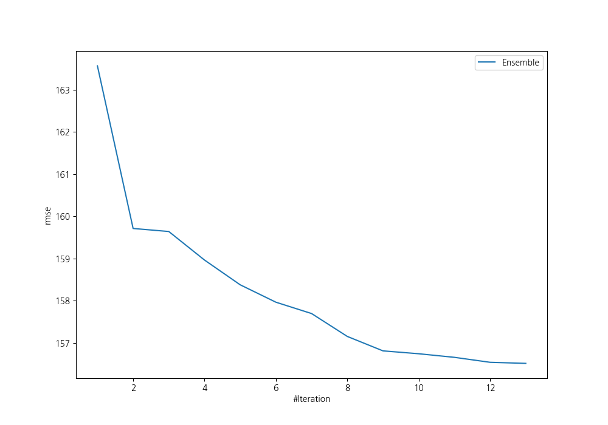
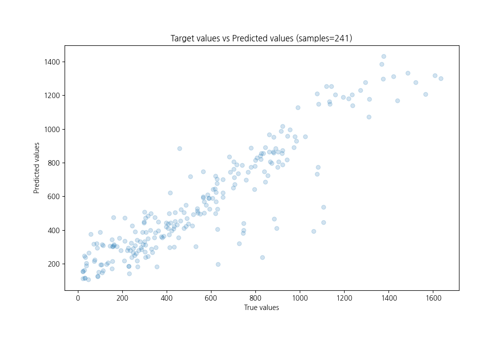
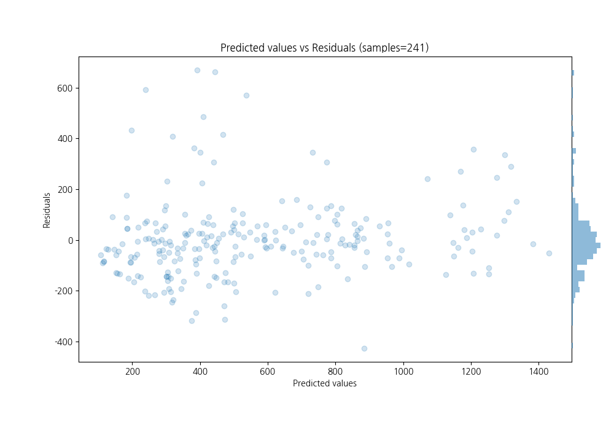

# Summary of Ensemble

[<< Go back](../README.md)

## Ensemble structure
| Model                                              |   Weight |
|:---------------------------------------------------|---------:|
| 13_LightGBM_GoldenFeatures_SelectedFeatures        |        3 |
| 1_Linear                                           |        1 |
| 23_NeuralNetwork                                   |        1 |
| 25_NeuralNetwork                                   |        1 |
| 39_RandomForest                                    |        1 |
| 46_CatBoost_GoldenFeatures_SelectedFeatures        |        3 |
| 47_CatBoost_GoldenFeatures_SelectedFeatures        |        1 |
| 4_Default_CatBoost_GoldenFeatures_SelectedFeatures |        1 |
| 9_Xgboost                                          |        1 |

### Metric details:
| Metric   |        Score |
|:---------|-------------:|
| MAE      |   105.638    |
| MSE      | 24496.4      |
| RMSE     |   156.513    |
| R2       |     0.828485 |
| MAPE     |     0.521468 |

## Learning curves

## True vs Predicted

## Predicted vs Residuals

[<< Go back](../README.md)
