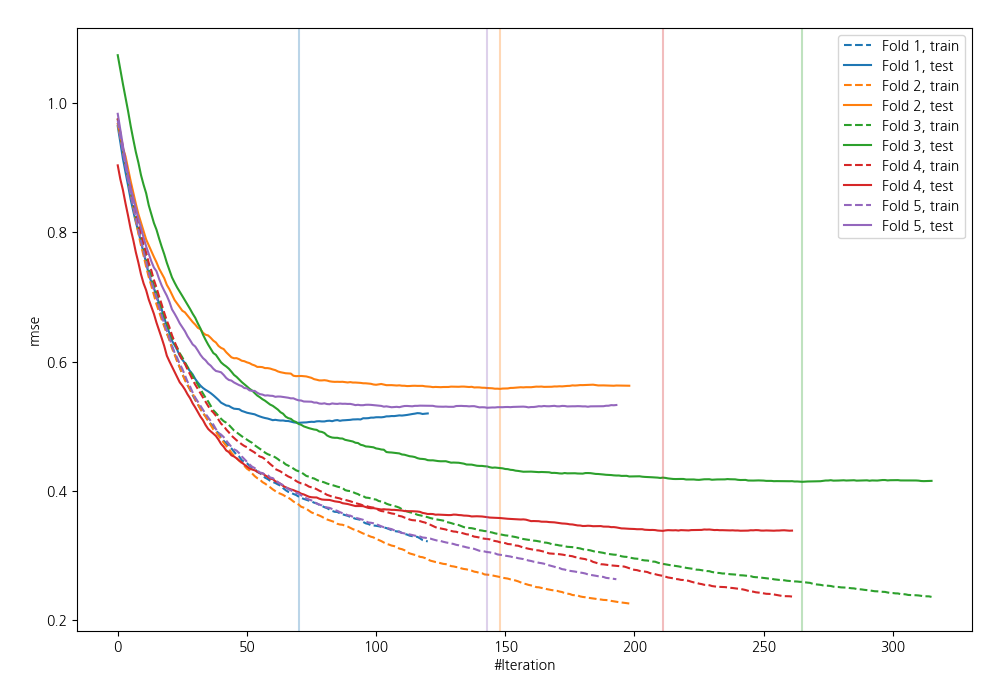
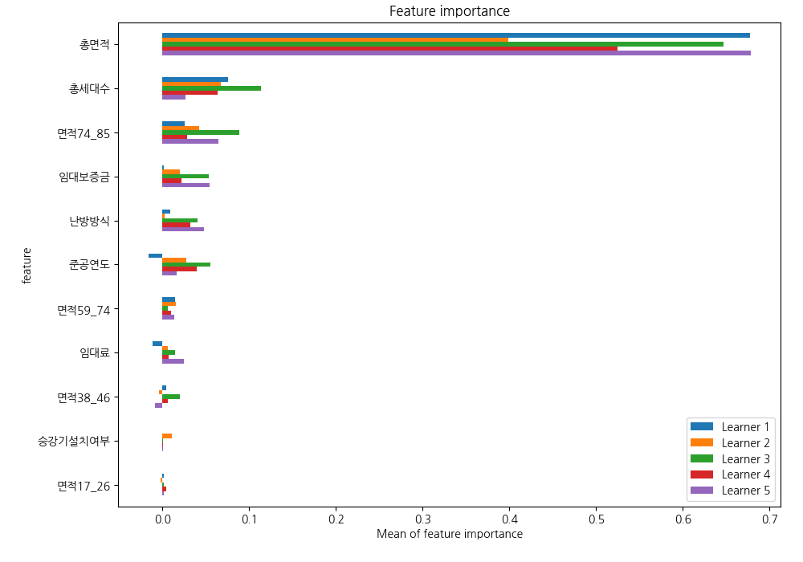
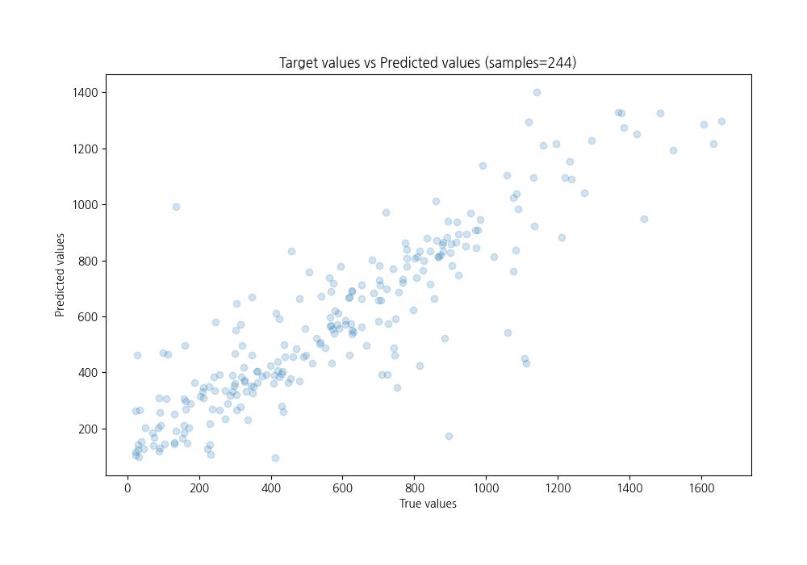
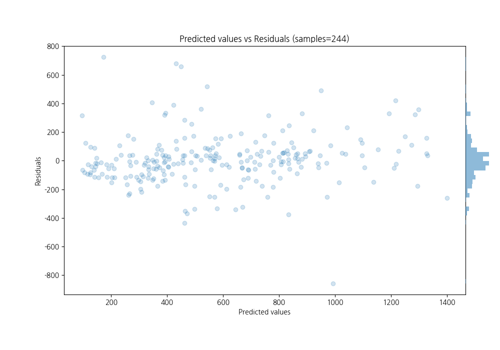

# Summary of 44_CatBoost_SelectedFeatures

[<< Go back](../README.md)

## CatBoost
- **n_jobs**: -1
- **learning_rate**: 0.05
- **depth**: 5
- **rsm**: 1
- **loss_function**: RMSE
- **eval_metric**: RMSE
- **explain_level**: 1

## Validation
 - **validation_type**: kfold
 - **k_folds**: 5
 - **shuffle**: True

## Optimized metric
rmse

## Training time

16.7 seconds

### Metric details:
| Metric   |        Score |
|:---------|-------------:|
| MAE      |   118.247    |
| MSE      | 31153.5      |
| RMSE     |   176.504    |
| R2       |     0.774229 |
| MAPE     |     0.540527 |

## Learning curves

## Permutation-based Importance

## True vs Predicted

## Predicted vs Residuals

[<< Go back](../README.md)
