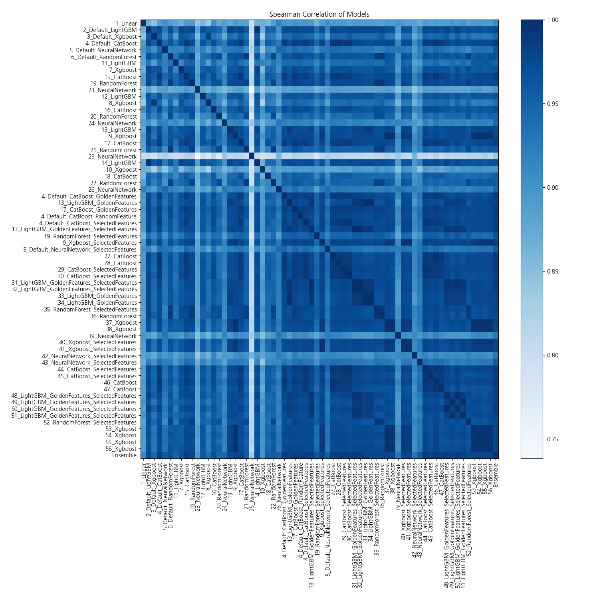

# AutoML Leaderboard

| Best model   | name                                                                                                 | model_type     | metric_type   |   metric_value |   train_time |   single_prediction_time |
|:-------------|:-----------------------------------------------------------------------------------------------------|:---------------|:--------------|---------------:|-------------:|-------------------------:|
|              | [1_Linear](1_Linear/README.md)                                                                       | Linear         | rmse          |        250.536 |         9.8  |                   0.0495 |
|              | [2_Default_LightGBM](2_Default_LightGBM/README.md)                                                   | LightGBM       | rmse          |        189.385 |         1.92 |                   0.0606 |
|              | [3_Default_Xgboost](3_Default_Xgboost/README.md)                                                     | Xgboost        | rmse          |        200.804 |         3.53 |                   0.058  |
|              | [4_Default_CatBoost](4_Default_CatBoost/README.md)                                                   | CatBoost       | rmse          |        180.429 |        16.07 |                   0.0235 |
|              | [5_Default_NeuralNetwork](5_Default_NeuralNetwork/README.md)                                         | Neural Network | rmse          |        190.663 |         1.55 |                   0.051  |
|              | [6_Default_RandomForest](6_Default_RandomForest/README.md)                                           | Random Forest  | rmse          |        192.454 |         3.62 |                   0.1169 |
|              | [11_LightGBM](11_LightGBM/README.md)                                                                 | LightGBM       | rmse          |        206.327 |         2.88 |                   0.0585 |
|              | [7_Xgboost](7_Xgboost/README.md)                                                                     | Xgboost        | rmse          |        192.484 |         2.16 |                   0.064  |
|              | [15_CatBoost](15_CatBoost/README.md)                                                                 | CatBoost       | rmse          |        190.024 |        25.83 |                   0.0239 |
|              | [19_RandomForest](19_RandomForest/README.md)                                                         | Random Forest  | rmse          |        189.9   |         3.79 |                   0.115  |
|              | [23_NeuralNetwork](23_NeuralNetwork/README.md)                                                       | Neural Network | rmse          |        231.839 |         1.57 |                   0.05   |
|              | [12_LightGBM](12_LightGBM/README.md)                                                                 | LightGBM       | rmse          |        194.537 |         1.91 |                   0.058  |
|              | [8_Xgboost](8_Xgboost/README.md)                                                                     | Xgboost        | rmse          |        200.597 |         2.3  |                   0.059  |
|              | [16_CatBoost](16_CatBoost/README.md)                                                                 | CatBoost       | rmse          |        198.225 |        22.43 |                   0.023  |
|              | [20_RandomForest](20_RandomForest/README.md)                                                         | Random Forest  | rmse          |        208.215 |         3.81 |                   0.1171 |
|              | [24_NeuralNetwork](24_NeuralNetwork/README.md)                                                       | Neural Network | rmse          |        205.773 |         1.72 |                   0.0504 |
|              | [13_LightGBM](13_LightGBM/README.md)                                                                 | LightGBM       | rmse          |        188.982 |         2.63 |                   0.059  |
|              | [9_Xgboost](9_Xgboost/README.md)                                                                     | Xgboost        | rmse          |        190.361 |         2.13 |                   0.0665 |
|              | [17_CatBoost](17_CatBoost/README.md)                                                                 | CatBoost       | rmse          |        189.175 |        17.35 |                   0.024  |
|              | [21_RandomForest](21_RandomForest/README.md)                                                         | Random Forest  | rmse          |        201.986 |         4.56 |                   0.116  |
|              | [25_NeuralNetwork](25_NeuralNetwork/README.md)                                                       | Neural Network | rmse          |        261.398 |         1.79 |                   0.0503 |
|              | [14_LightGBM](14_LightGBM/README.md)                                                                 | LightGBM       | rmse          |        191.312 |         2.33 |                   0.057  |
|              | [10_Xgboost](10_Xgboost/README.md)                                                                   | Xgboost        | rmse          |        234.459 |         2.12 |                   0.056  |
|              | [18_CatBoost](18_CatBoost/README.md)                                                                 | CatBoost       | rmse          |        211.056 |        16.27 |                   0.022  |
|              | [22_RandomForest](22_RandomForest/README.md)                                                         | Random Forest  | rmse          |        211.845 |         4    |                   0.114  |
|              | [26_NeuralNetwork](26_NeuralNetwork/README.md)                                                       | Neural Network | rmse          |        206.71  |         1.76 |                   0.05   |
|              | [4_Default_CatBoost_GoldenFeatures](4_Default_CatBoost_GoldenFeatures/README.md)                     | CatBoost       | rmse          |        181.669 |        18.08 |                   0.041  |
|              | [13_LightGBM_GoldenFeatures](13_LightGBM_GoldenFeatures/README.md)                                   | LightGBM       | rmse          |        186.138 |         3.6  |                   0.103  |
|              | [17_CatBoost_GoldenFeatures](17_CatBoost_GoldenFeatures/README.md)                                   | CatBoost       | rmse          |        185.364 |        17.22 |                   0.041  |
|              | [4_Default_CatBoost_RandomFeature](4_Default_CatBoost_RandomFeature/README.md)                       | CatBoost       | rmse          |        185.519 |        15.21 |                   0.025  |
|              | [4_Default_CatBoost_SelectedFeatures](4_Default_CatBoost_SelectedFeatures/README.md)                 | CatBoost       | rmse          |        181.085 |        13.53 |                   0.022  |
|              | [13_LightGBM_GoldenFeatures_SelectedFeatures](13_LightGBM_GoldenFeatures_SelectedFeatures/README.md) | LightGBM       | rmse          |        185.144 |         2.55 |                   0.095  |
|              | [19_RandomForest_SelectedFeatures](19_RandomForest_SelectedFeatures/README.md)                       | Random Forest  | rmse          |        187.461 |         3.35 |                   0.1121 |
|              | [9_Xgboost_SelectedFeatures](9_Xgboost_SelectedFeatures/README.md)                                   | Xgboost        | rmse          |        191.535 |         2.3  |                   0.058  |
|              | [5_Default_NeuralNetwork_SelectedFeatures](5_Default_NeuralNetwork_SelectedFeatures/README.md)       | Neural Network | rmse          |        192.08  |         1.89 |                   0.044  |
|              | [27_CatBoost](27_CatBoost/README.md)                                                                 | CatBoost       | rmse          |        180.356 |        13.17 |                   0.022  |
|              | [28_CatBoost](28_CatBoost/README.md)                                                                 | CatBoost       | rmse          |        184.055 |        18.78 |                   0.023  |
|              | [29_CatBoost_SelectedFeatures](29_CatBoost_SelectedFeatures/README.md)                               | CatBoost       | rmse          |        176.159 |        14.21 |                   0.022  |
|              | [30_CatBoost_SelectedFeatures](30_CatBoost_SelectedFeatures/README.md)                               | CatBoost       | rmse          |        182.714 |        15.81 |                   0.021  |
|              | [31_LightGBM_GoldenFeatures_SelectedFeatures](31_LightGBM_GoldenFeatures_SelectedFeatures/README.md) | LightGBM       | rmse          |        185.144 |         2.62 |                   0.093  |
|              | [32_LightGBM_GoldenFeatures_SelectedFeatures](32_LightGBM_GoldenFeatures_SelectedFeatures/README.md) | LightGBM       | rmse          |        185.144 |         2.62 |                   0.094  |
|              | [33_LightGBM_GoldenFeatures](33_LightGBM_GoldenFeatures/README.md)                                   | LightGBM       | rmse          |        186.138 |         3.68 |                   0.096  |
|              | [34_LightGBM_GoldenFeatures](34_LightGBM_GoldenFeatures/README.md)                                   | LightGBM       | rmse          |        186.138 |         3.74 |                   0.057  |
|              | [35_RandomForest_SelectedFeatures](35_RandomForest_SelectedFeatures/README.md)                       | Random Forest  | rmse          |        186.679 |         4.81 |                   0.1134 |
|              | [36_RandomForest](36_RandomForest/README.md)                                                         | Random Forest  | rmse          |        188.625 |         4.54 |                   0.1129 |
|              | [37_Xgboost](37_Xgboost/README.md)                                                                   | Xgboost        | rmse          |        189.422 |         2.56 |                   0.0584 |
|              | [38_Xgboost](38_Xgboost/README.md)                                                                   | Xgboost        | rmse          |        191.303 |         2.47 |                   0.051  |
|              | [39_NeuralNetwork](39_NeuralNetwork/README.md)                                                       | Neural Network | rmse          |        213.357 |         2.17 |                   0.051  |
|              | [40_Xgboost_SelectedFeatures](40_Xgboost_SelectedFeatures/README.md)                                 | Xgboost        | rmse          |        190.85  |         2.5  |                   0.0555 |
|              | [41_Xgboost_SelectedFeatures](41_Xgboost_SelectedFeatures/README.md)                                 | Xgboost        | rmse          |        192.659 |         2.4  |                   0.05   |
|              | [42_NeuralNetwork_SelectedFeatures](42_NeuralNetwork_SelectedFeatures/README.md)                     | Neural Network | rmse          |        221.852 |         2.09 |                   0.043  |
|              | [43_NeuralNetwork_SelectedFeatures](43_NeuralNetwork_SelectedFeatures/README.md)                     | Neural Network | rmse          |        196.423 |         2.2  |                   0.045  |
|              | [44_CatBoost_SelectedFeatures](44_CatBoost_SelectedFeatures/README.md)                               | CatBoost       | rmse          |        176.504 |        17.06 |                   0.022  |
|              | [45_CatBoost_SelectedFeatures](45_CatBoost_SelectedFeatures/README.md)                               | CatBoost       | rmse          |        181.042 |         8.63 |                   0.022  |
|              | [46_CatBoost](46_CatBoost/README.md)                                                                 | CatBoost       | rmse          |        174.478 |        19.68 |                   0.024  |
|              | [47_CatBoost](47_CatBoost/README.md)                                                                 | CatBoost       | rmse          |        177.828 |         9.88 |                   0.023  |
|              | [48_LightGBM_GoldenFeatures_SelectedFeatures](48_LightGBM_GoldenFeatures_SelectedFeatures/README.md) | LightGBM       | rmse          |        180.303 |         2.83 |                   0.062  |
|              | [49_LightGBM_GoldenFeatures_SelectedFeatures](49_LightGBM_GoldenFeatures_SelectedFeatures/README.md) | LightGBM       | rmse          |        186.72  |         3.1  |                   0.094  |
|              | [50_LightGBM_GoldenFeatures_SelectedFeatures](50_LightGBM_GoldenFeatures_SelectedFeatures/README.md) | LightGBM       | rmse          |        180.303 |         2.84 |                   0.093  |
|              | [51_LightGBM_GoldenFeatures_SelectedFeatures](51_LightGBM_GoldenFeatures_SelectedFeatures/README.md) | LightGBM       | rmse          |        186.72  |         3.05 |                   0.093  |
|              | [52_RandomForest_SelectedFeatures](52_RandomForest_SelectedFeatures/README.md)                       | Random Forest  | rmse          |        187.493 |         3.85 |                   0.112  |
|              | [53_Xgboost](53_Xgboost/README.md)                                                                   | Xgboost        | rmse          |        188.292 |         2.81 |                   0.053  |
|              | [54_Xgboost](54_Xgboost/README.md)                                                                   | Xgboost        | rmse          |        191.738 |         2.8  |                   0.055  |
|              | [55_Xgboost](55_Xgboost/README.md)                                                                   | Xgboost        | rmse          |        186.944 |         2.81 |                   0.054  |
|              | [56_Xgboost](56_Xgboost/README.md)                                                                   | Xgboost        | rmse          |        190.778 |         2.78 |                   0.054  |
| **the best** | [Ensemble](Ensemble/README.md)                                                                       | Ensemble       | rmse          |        168.711 |         0.61 |                   0.4225 |

### AutoML Performance

### AutoML Performance Boxplot

### Features Importance

### Spearman Correlation of Models

